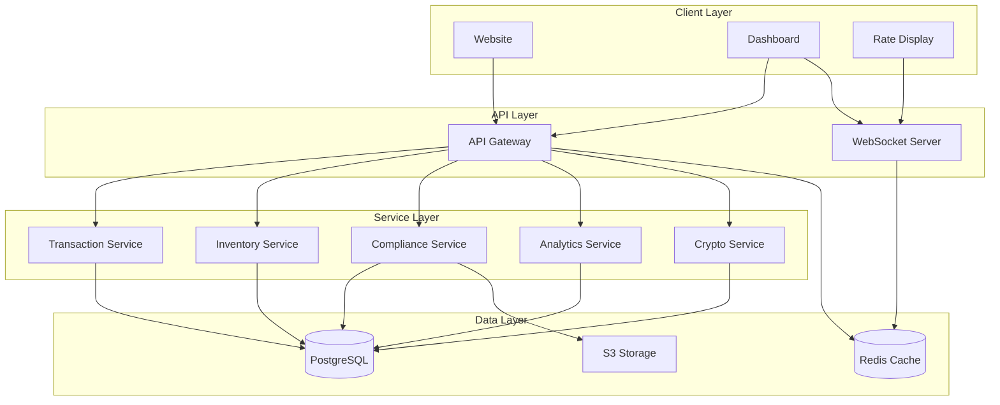

# LeaperFX Phase 2: Production Refactoring Plan

## Executive Summary
Transition from POC/demo to production-ready system with three distinct products, proper separation of concerns, and enterprise-grade architecture.

## Current State Analysis

### Issues Identified
1. **Monolithic Architecture**: All features bundled in single dashboard application
2. **Mixed Concerns**: Business logic, UI, and data access intertwined
3. **No API Layer**: Direct service imports without proper abstraction
4. **Tight Coupling**: Components directly depend on services
5. **Missing Infrastructure**: No authentication, caching, or monitoring

### Current Structure
```
dashboard/demo/src/
├── components/     # Mixed UI components (43 components)
├── services/       # Business logic services (23 services)
├── tabs/          # Dashboard sections (7 tabs)
├── models/        # Data models
└── utils/         # Utilities
```

## Target Architecture: Three Products

### 1. Public Website (`apps/website`)
**Purpose**: Customer-facing portal for rates, calculator, and inquiries
- **Tech Stack**: Next.js 14, Tailwind CSS, Framer Motion
- **Features**:
  - Live exchange rates display
  - Currency calculator
  - QR code lead generation
  - Contact forms
  - SEO optimized
  - Mobile responsive

### 2. Dashboard OS (`apps/dashboard`)
**Purpose**: Store owner's complete operating system
- **Tech Stack**: React 19, TypeScript, Vite, Recharts
- **Features**:
  - Transaction management
  - Inventory control
  - FINTRAC compliance
  - Analytics & insights
  - Customer management
  - Stripe terminal integration
  - Multi-user support with roles

### 3. Rate Display Board (`apps/rate-display`)
**Purpose**: Public-facing real-time rate display
- **Tech Stack**: React, WebSocket, Digital signage optimized
- **Features**:
  - Real-time rate updates
  - Multi-currency display
  - Customizable layouts
  - Auto-refresh capability
  - Offline mode support

## Refactoring Strategy

### Phase 1: Foundation (Week 1-2)
```typescript
// 1. Setup Monorepo Structure
leaperfx/
├── apps/
│   ├── website/
│   ├── dashboard/
│   └── rate-display/
├── packages/
│   ├── @leaperfx/shared-ui/
│   ├── @leaperfx/core-services/
│   ├── @leaperfx/api-client/
│   └── @leaperfx/types/
├── services/
│   ├── api-gateway/
│   ├── websocket-server/
│   └── crypto-service/
└── package.json (workspace root)
```

### Phase 2: Service Extraction (Week 3-4)
```typescript
// Extract and refactor services into packages/core-services/

// Before (tight coupling):
import transactionService from './services/transactionService';

// After (dependency injection):
import { TransactionService } from '@leaperfx/core-services';
const transactionService = new TransactionService(apiClient);
```

### Phase 3: API Gateway Implementation (Week 5-6)
```typescript
// API Gateway with authentication and rate limiting
services/api-gateway/
├── src/
│   ├── routes/
│   │   ├── auth.routes.ts
│   │   ├── transaction.routes.ts
│   │   ├── inventory.routes.ts
│   │   └── compliance.routes.ts
│   ├── middleware/
│   │   ├── auth.middleware.ts
│   │   ├── rateLimit.middleware.ts
│   │   └── validation.middleware.ts
│   └── index.ts
```

### Phase 4: Component Library (Week 7-8)
```typescript
// Shared UI Components
packages/shared-ui/
├── src/
│   ├── components/
│   │   ├── Calculator/
│   │   ├── RateDisplay/
│   │   ├── Modal/
│   │   └── Forms/
│   ├── hooks/
│   │   ├── useExchangeRates.ts
│   │   └── useWebSocket.ts
│   └── index.ts
```

## Service Architecture

### API Gateway Routes
```typescript
// REST API Endpoints
POST   /api/auth/login
POST   /api/auth/refresh
GET    /api/rates/current
GET    /api/rates/history
POST   /api/transactions/create
GET    /api/transactions/list
PUT    /api/inventory/update
GET    /api/analytics/dashboard
POST   /api/compliance/report
GET    /api/crypto/rates
POST   /api/crypto/transaction
```

### WebSocket Events
```typescript
// Real-time events
ws://api.leaperfx.com/realtime
├── rate:update
├── transaction:created
├── inventory:alert
├── compliance:deadline
└── system:notification
```

## Data Flow Architecture



## Migration Plan

### Week 1-2: Setup Infrastructure
- [ ] Initialize monorepo with Turborepo
- [ ] Setup shared TypeScript config
- [ ] Create package structure
- [ ] Setup CI/CD pipeline

### Week 3-4: Extract Core Services
- [ ] Refactor transaction service
- [ ] Refactor inventory service
- [ ] Refactor compliance service
- [ ] Create service interfaces

### Week 5-6: Build API Gateway
- [ ] Implement authentication
- [ ] Create REST endpoints
- [ ] Add rate limiting
- [ ] Setup WebSocket server

### Week 7-8: Separate Applications
- [ ] Extract website components
- [ ] Build rate display app
- [ ] Refactor dashboard
- [ ] Create shared UI library

### Week 9-10: Integration & Testing
- [ ] Integrate Stripe terminals
- [ ] Implement crypto service
- [ ] End-to-end testing
- [ ] Performance optimization

### Week 11-12: Deployment
- [ ] Setup production database
- [ ] Configure domain & SSL
- [ ] Deploy to cloud
- [ ] Monitoring setup

## Technology Stack

### Frontend
- **Website**: Next.js 14, React 19, Tailwind CSS
- **Dashboard**: React 19, Vite, TypeScript, Recharts
- **Rate Display**: React, WebSocket, CSS Grid

### Backend
- **API**: Node.js, Express, TypeScript
- **Database**: PostgreSQL 15
- **Cache**: Redis
- **Queue**: Bull MQ
- **WebSocket**: Socket.io

### Infrastructure
- **Hosting**: Vercel (Frontend), Railway (Backend)
- **CDN**: Cloudflare
- **Storage**: AWS S3
- **Monitoring**: Sentry, LogRocket
- **CI/CD**: GitHub Actions

## Security Considerations

### Authentication & Authorization
```typescript
// JWT-based authentication with refresh tokens
interface AuthToken {
  userId: string;
  storeId: string;
  role: 'owner' | 'operator' | 'viewer';
  permissions: string[];
}

// Role-based access control
const permissions = {
  owner: ['*'],
  operator: ['transactions:*', 'inventory:read', 'compliance:*'],
  viewer: ['*:read']
};
```

### Data Protection
- End-to-end encryption for sensitive data
- PCI compliance for payment processing
- FINTRAC compliance for reporting
- Regular security audits
- Automated backup strategy

## Performance Targets

### Website
- First Contentful Paint: < 1.2s
- Time to Interactive: < 2.5s
- Lighthouse Score: > 95

### Dashboard
- Initial Load: < 3s
- API Response: < 200ms
- WebSocket Latency: < 50ms

### Rate Display
- Update Frequency: Real-time (< 100ms)
- Offline Capability: 24 hours
- Auto-recovery: Yes

## Monitoring & Analytics

### Application Monitoring
- Error tracking with Sentry
- Performance monitoring
- User session recording
- Custom business metrics

### Infrastructure Monitoring
- Server health checks
- Database performance
- API response times
- WebSocket connections

## Cost Optimization

### Estimated Monthly Costs
- Hosting (Vercel Pro): $20
- Backend (Railway): $20
- Database (PostgreSQL): $20
- Redis Cache: $10
- CDN (Cloudflare): Free tier
- Monitoring: $50
- **Total**: ~$120/month

## Success Metrics

### Technical Metrics
- 99.9% uptime
- < 200ms API response time
- Zero critical vulnerabilities
- 90%+ test coverage

### Business Metrics
- 90-second quote-to-receipt workflow
- Real-time rate updates
- Automated FINTRAC reporting
- Multi-device support

## Risk Mitigation

### Technical Risks
1. **Data Migration**: Incremental migration with rollback capability
2. **Performance**: Caching strategy and CDN implementation
3. **Security**: Regular audits and penetration testing
4. **Scalability**: Horizontal scaling capability

### Business Risks
1. **Downtime**: Blue-green deployment strategy
2. **Data Loss**: Automated backups every 6 hours
3. **Compliance**: Automated FINTRAC reporting
4. **User Training**: Comprehensive documentation

## Implementation Timeline

### Milestone 1: Infrastructure (Weeks 1-4)
- Monorepo setup
- Service extraction
- API gateway
- Database migration

### Milestone 2: Applications (Weeks 5-8)
- Website development
- Dashboard refactoring
- Rate display board
- Shared components

### Milestone 3: Integration (Weeks 9-12)
- Stripe integration
- Crypto service
- Testing & QA
- Performance optimization

### Milestone 4: Deployment (Weeks 13-16)
- Production setup
- Domain configuration
- SSL certificates
- Go-live

## Conclusion

This refactoring plan transforms the current POC into a production-ready, scalable platform with clear separation of concerns, maintainable architecture, and room for future growth. The three-product approach ensures each component can evolve independently while sharing common infrastructure and services.

## Next Steps
1. Review and approve refactoring plan
2. Setup development environment
3. Begin Phase 1 implementation
4. Weekly progress reviews
5. Continuous integration and testing