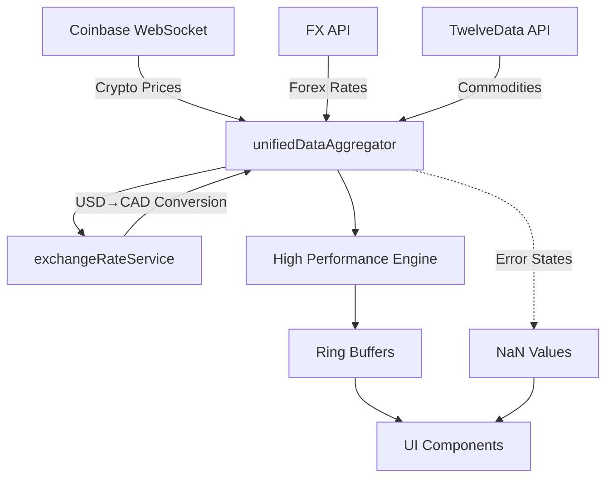

# Exchange Currency Dashboard - Current State Mapping

## 📁 Directory Structure
```
exchange_currency_dash/
├── ExchangeDashboard.tsx       # Main dashboard component
├── components/
│   ├── DataSourceStatus.tsx    # Shows health of data feeds
│   ├── HighPerformanceSparkline.tsx
│   ├── RealTimeCryptoSection.tsx
│   └── SignalEffects.tsx
├── services/
│   ├── unifiedDataAggregator.ts    # Central data hub
│   ├── coinbaseWebSocketService.ts # Crypto WebSocket
│   ├── realTimeDataManager.ts      # UI data coordinator
│   ├── chartDataAdapter.ts
│   ├── animationBufferService.ts
│   ├── errorHandlingService.ts
│   ├── RingBuffer.ts
│   ├── RotationScheduler.ts
│   ├── SignalDetectionEngine.ts
│   └── SparklineEngine.ts
├── config/
│   └── instrumentCatalog.ts    # All tradeable instruments
├── hooks/
│   └── useHighPerformanceEngine.tsx
└── styles/

```

## 🔌 API Providers & Status

### 1. **Coinbase WebSocket** (CRYPTO) ✅ WORKING
- **URL**: wss://ws-feed.pro.coinbase.com
- **Instruments**: BTC, ETH, SOL, AVAX, MATIC, ADA
- **Status**: Connected and receiving data
- **Issue Fixed**: Race condition on send before OPEN
- **Data Flow**: Coinbase → coinbaseWebSocketService → unifiedDataAggregator → engine

### 2. **FX API** (FOREX) ⚠️ PARTIAL
- **URL**: https://api.fxapi.com/v1
- **Key**: fxa_live_D6Cfe4rUyNQBJbRpmYq3KNmpEY2WpRtFz43iCw7j
- **Instruments**: USD/CAD, EUR/CAD, GBP/CAD, JPY/CAD, CHF/CAD
- **Status**: Configured but may need rate limiting
- **Issue**: Needs proper implementation in aggregator

### 3. **TwelveData** (COMMODITIES) ❌ NOT WORKING
- **URL**: https://api.twelvedata.com/v1
- **Key**: 335886f485a64be0aa7a2853a24e5276
- **Instruments**: GOLD, SILVER, COPPER, CRUDE, PLATINUM, ALUMINUM
- **Status**: Returns NaN (disabled)
- **Issue**: API not integrated

### 4. **Alpaca** (US MARKETS) ❌ NOT USED
- **URL**: https://paper-api.alpaca.markets/v2
- **Key**: PKCLXTE0X4X2LH8LX2LT
- **Status**: Configured but not implemented

### 5. **Bank of Canada** (YIELDS) ❌ DISABLED
- **Status**: Returns NaN (404 errors)
- **Issue**: API endpoint broken

## 🎨 Design Theme & Colors

### Background Colors (KEEP AS-IS):
```css
/* Card backgrounds - Bloomberg style */
background: linear-gradient(135deg, #000000 0%, #000814 50%, #001428 100%)

/* Main background */
background: black
```

### Text Colors:
- **Symbols**: `#FFA500` (Orange)
- **Prices**: `white`
- **Positive**: `#00FF88` (Green) with ▲
- **Negative**: `#FF4444` (Red) with ▼
- **Headers**: `#FFB000` (Yellow-Orange)

### Special Elements:
1. **Daily Bulletin**: Orange border (#FFA500)
2. **Ticker Bar**: Yellow-orange gradient (#FFD700 → #FF6B00)
3. **SAADAT EXCHANGE**: Text, not logo

## 🔄 Data Flow Architecture



## 🐛 Current Issues

### Critical:
1. **Infinite render loop** ✅ FIXED
   - Removed engine.pushData dependency

### High Priority:
1. **Commodities not displaying**
   - Grid hidden when no data
   - Need to show error states

2. **FX rates not updating**
   - API integration incomplete
   - Need proper polling mechanism

### Medium Priority:
1. **NextAuth 404 errors**
   - Remnant auth calls need removal

2. **Mock data replaced with NaN**
   - Need proper error UI states

## 📊 Component Status

| Component | Data Source | Status | Issue |
|-----------|------------|--------|-------|
| Crypto Cards | Coinbase WS | ✅ Working | Data flowing |
| Forex Cards | FX API | ⚠️ Partial | Not updating |
| Commodities | TwelveData | ❌ Broken | Returns NaN |
| Daily Bulletin | Local | ✅ Working | Rotates properly |
| CAD Yield | Bank of Canada | ❌ Disabled | API 404 |
| Ticker Bar | Mixed | ⚠️ Partial | Needs real data |

## 🎯 Implementation Plan

### Phase 1: Fix Data Sources (Current)
- [x] Fix Coinbase WebSocket race condition
- [x] Disable WebSocket on static hosting
- [x] Replace mock data with NaN
- [ ] Implement FX API polling
- [ ] Integrate TwelveData for commodities

### Phase 2: UI Error States
- [ ] Show loading spinners
- [ ] Display "No Data" gracefully
- [ ] Add retry mechanisms
- [ ] Implement fallback displays

### Phase 3: Complete Integration
- [ ] Connect all live data sources
- [ ] Ensure CAD conversion works
- [ ] Test data flow end-to-end
- [ ] Performance optimization

## 🔧 Next Steps

1. **Fix FX API Integration**
   - Add proper polling in unifiedDataAggregator
   - Handle rate limits
   - Convert to CAD

2. **Fix Commodities Display**
   - Integrate TwelveData API
   - Show grid even with errors
   - Add loading states

3. **Improve Error UI**
   - Replace NaN with proper messages
   - Add loading indicators
   - Show connection status

## 📝 Notes

- Dashboard is 70% complete
- Core architecture is solid
- Main issues are API integrations
- UI needs error state handling
- Performance engine working well